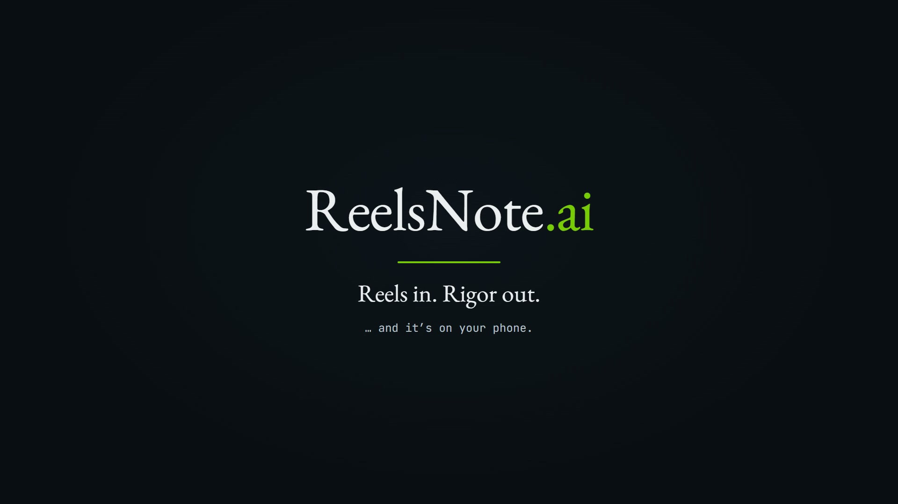

<div align="center">

# ReelsNote.ai

**An agentic pipeline that turns short-form social videos into rigorous, printable study notes.**

<br/>

<video src="https://raw.githubusercontent.com/ArpitKadam/ReelsNote.ai/main/brag.mp4" poster="https://raw.githubusercontent.com/ArpitKadam/ReelsNote.ai/main/brag.jpg" controls muted width="840">
  <a href="https://raw.githubusercontent.com/ArpitKadam/ReelsNote.ai/main/brag.mp4">
    
  </a>
</video>

<sub>▶️ Video not playing? <a href="https://raw.githubusercontent.com/ArpitKadam/ReelsNote.ai/main/brag.mp4">Click here to watch the launch clip.</a></sub>

<em>Paste one reel URL, get back a rigorous, LaTeX-typeset study PDF. Four LangGraph agents turn a 60-second doomscroll into a paper. <strong>Reels in. Rigor out.</strong></em>

<br/>

[](https://www.python.org/)
[](https://langchain-ai.github.io/langgraph/)
[](https://pytorch.org/)
[](https://github.com/openai/whisper)

[](https://build.nvidia.com/)
[](https://groq.com/)
[](https://github.com/yt-dlp/yt-dlp)
[](https://ffmpeg.org/)

[](https://pymupdf.readthedocs.io/)
[](https://matplotlib.org/)
[](https://github.com/Textualize/rich)
[](https://github.com/features/actions)

</div>

---

## Abstract

Educational content is increasingly delivered through short-form video (Instagram Reels, YouTube Shorts, TikTok), a format optimized for engagement rather than retention. Such videos are ephemeral, non-searchable, and hard to review. **ReelsNote.ai** addresses this by treating a reel as a *knowledge artifact*: given only a URL, the system downloads the media, transcribes its audio, analyzes its visual content with a video-language model, synthesizes a structured study report with a large language model, and typesets the result — complete with rendered LaTeX mathematics — into a paginated, indexed PDF (`notes.pdf`). The pipeline is implemented as a directed acyclic graph of four idempotent agents orchestrated by LangGraph, and ships with a CI hook that automatically delivers each rebuilt notebook to Telegram.

---

## 1. Introduction

Watching a 60-second reel that explains, say, *Gini impurity in decision trees* is easy; recalling it a week later is not. The knowledge is locked inside a stream you cannot grep, annotate, or print.

ReelsNote.ai converts that stream into a durable learning resource. Its design goals are:

- **Zero manual effort** — one URL in, one polished PDF out.
- **Faithful, not surface-level** — teach the *why* and *how* behind the content, never a caption rewrite.
- **Multi-modal grounding** — fuse spoken audio, on-screen visuals, and the caption into a single reconciled report.
- **Idempotent & incremental** — every stage caches its output; re-running a URL is free, and each new reel is appended into a growing, auto-indexed notebook.
- **Faithful mathematics** — formulas render as real notation, not raw `$...$` source.

---

## 2. System Architecture

The system is a compiled `StateGraph` (LangGraph) whose shared state (`FinalState`, a `TypedDict`) flows through four nodes in sequence. Each node reads the state, performs one responsibility, and returns a partial update.

```
         ┌─────────┐      ┌──────────┐      ┌──────────┐     ┌────────┐
URL ──▶ │ scrape  │ ──▶  │ explain  │ ──▶ │  report  │ ──▶ │  pdf   │ ──▶ notes.pdf
         └─────────┘      └──────────┘      └──────────┘     └────────┘
         yt-dlp +          NVIDIA NIM         Groq LLM        PyMuPDF +
         Whisper           video VLM          synthesis       matplotlib
```

> A live Mermaid render of the compiled graph is written to `pipeline.png` on first run.

### 2.1 Shared State

| Field | Type | Produced by |
|-------|------|-------------|
| `url`, `title`, `caption` | `str` | scrape |
| `video_path`, `has_audio` | `str`, `bool` | scrape |
| `transcript` | `str \| None` | scrape (Whisper) |
| `video_explanation`, `question` | `str \| None` | explain |
| `report` | `str \| None` | report |
| `notes_pdf_path` | `str \| None` | pdf |

---

## 3. Methodology (Pipeline Stages)

### 3.1 Ingestion & Transcription — `scrape`

Implemented in `src/helpers/reel_scrapper.py`.

1. Resolves reel metadata with **yt-dlp** (no download), deriving a filesystem-safe folder name (`src/utils/paths.py`).
2. Downloads best video + audio and merges to MP4 via **FFmpeg**.
3. Probes for an audio stream with `ffprobe`. If present, transcribes with **OpenAI Whisper**; if absent, attempts an audio-only fallback download before declaring the reel silent.
4. Whisper runs on **CUDA** when a GPU is detected (FP16), gracefully falling back to CPU. Language is pinned (default `en`) to suppress the auto-detect misfires that cause hallucinated gibberish on music/noisy intros; anti-hallucination decoding thresholds are applied.

*Idempotency:* results are persisted to `output/{title}/info.json` and returned directly on re-run.

### 3.2 Visual Understanding — `explain`

Implemented in `src/helpers/video_explainer.py`, backed by an **NVIDIA NIM** video-language model.

- The full MP4 is base64-encoded and sent inline to the VLM with an *educator* prompt that extracts the underlying knowledge rather than narrating the screen.
- **Long-video handling:** files exceeding `NVIDIA_MAX_VIDEO_MB` (default 20 MB) would overflow the inline payload limit, so the video is split with keyframe-aligned FFmpeg stream-copy into ~12 MB segments. Each segment is explained independently, then a synthesis prompt merges the per-segment notes into one coherent explanation.
- Output follows a strict contract: a leading `QUESTION:` line (the single question the reel answers, later used as its index title), a `---` separator, then a Markdown body with headings, code fences, and LaTeX math.

### 3.3 Report Synthesis — `report`

Implemented in `src/helpers/report_generator.py`, backed by **Groq** (`openai/gpt-oss-120b`).

Three sources — caption, transcript, and visual explanation — are fused by an expert-technical-writer prompt into a single deep report following a fixed six-section template: *Overview → Key Concepts → Detailed Explanation → Step-by-Step → Practical Takeaways → Further Notes*. Overlapping information is reconciled rather than repeated, and all mathematics is emitted as `$...$` / `$$...$$` LaTeX (never inside code fences).

### 3.4 Typesetting — `pdf`

Implemented in `src/helpers/pdf_converter.py` using **PyMuPDF** and **Matplotlib**.

- Markdown is converted to HTML with math spans protected from code fences; each `$...$` / `$$...$$` expression is rendered to a transparent-flattened PNG via matplotlib's mathtext engine and inlined at text-matched scale.
- Each reel becomes a self-contained PDF: **page 1** is a styled cover stating the question, **remaining pages** are the rendered report.
- A JSON **manifest** tracks every reel processed (deduplicated by URL). On each run the global `notes.pdf` is rebuilt as `[ index ] + [ reel 1 ] + [ reel 2 ] + …`, with the index PDF built separately, page offsets computed via a fixed-point pass, and concatenated in front.

---

## 4. Implementation

```
ReelsNote-ai/
├── main.py                       # Entry point: build graph, invoke, print final state
├── src/
│   ├── pipeline/pipeline.py      # LangGraph StateGraph: scrape→explain→report→pdf
│   ├── state/states.py           # FinalState TypedDict (shared graph state)
│   ├── settings/settings.py      # Frozen dataclass config, env-driven
│   ├── helpers/
│   │   ├── reel_scrapper.py      # yt-dlp + ffmpeg + Whisper
│   │   ├── video_explainer.py    # NVIDIA NIM video VLM (+ chunking)
│   │   ├── report_generator.py   # Groq report synthesis
│   │   └── pdf_converter.py      # PyMuPDF + matplotlib PDF/index builder
│   └── utils/
│       ├── paths.py              # Title sanitization → safe folder names
│       └── logging_config.py     # Colorized console logging
├── .github/workflows/
│   └── send-notes-telegram.yml   # CI: push notes.pdf → Telegram
├── pyproject.toml / requirements.txt
└── notes.pdf                     # Generated aggregate notebook
```

**Design principles.** Every stage is *idempotent* (checks for its cached artifact before doing work), *isolated* (one file, one responsibility), and *fail-soft* (returns `None` and logs rather than crashing the graph). Configuration is centralized in a single frozen `Settings` dataclass driven by environment variables.

---

## 5. Reproduction (Installation & Usage)

### 5.1 Prerequisites

- **Python ≥ 3.13**
- **FFmpeg** (with `ffprobe`) on `PATH`
- **API keys:** a Groq API key and an NVIDIA NIM (build.nvidia.com) API key
- *(Optional)* an NVIDIA GPU with CUDA 12.4 for accelerated Whisper

### 5.2 Setup

```bash
git clone https://github.com/ArpitKadam/ReelsNote.ai.git
cd ReelsNote.ai

# Recommended: uv (pulls CUDA torch from the pinned index)
uv sync
# or with pip
pip install -r requirements.txt
```

Create a `.env` in the project root:

```env
GROQ_API_KEY=your_groq_key
NVIDIA_API_KEY=your_nvidia_key

# Optional overrides
GROQ_LLM_MODEL=openai/gpt-oss-120b
NVIDIA_MODEL=nvidia/nemotron-3-nano-omni-30b-a3b-reasoning
WHISPER_LANGUAGE=en
NVIDIA_MAX_VIDEO_MB=20
NVIDIA_CHUNK_MB=12
```

### 5.3 Run

```bash
python main.py "https://www.instagram.com/reel/XXXXXXXXX/"
```

The pipeline logs each node, prints a final-state summary, and writes/updates `notes.pdf` at the repository root. Per-reel artifacts land in `output/{title}/`.

---

## 6. Configuration Reference

| Variable | Default | Purpose |
|----------|---------|---------|
| `GROQ_API_KEY` | — | Groq authentication (report synthesis) |
| `NVIDIA_API_KEY` | — | NVIDIA NIM authentication (video analysis) |
| `GROQ_LLM_MODEL` | `openai/gpt-oss-120b` | Report-generation model |
| `NVIDIA_MODEL` | `nvidia/nemotron-3-nano-omni-30b-a3b-reasoning` | Video-language model |
| `WHISPER_LANGUAGE` | `en` | Forced ASR language (`auto`/`""` to auto-detect) |
| `NVIDIA_MAX_VIDEO_MB` | `20` | Inline-payload ceiling before chunking kicks in |
| `NVIDIA_CHUNK_MB` | `12` | Approximate size per split segment |

Whisper model size (`small`) and all output filenames are set in `src/settings/settings.py`.

---

## 7. Continuous Delivery

The workflow `.github/workflows/send-notes-telegram.yml` triggers on any push that modifies `notes.pdf` (or via manual dispatch). It sends the updated PDF to a Telegram chat via the Bot API, captioned with the repository and commit. Requires two repository secrets:

| Secret | Description |
|--------|-------------|
| `TELEGRAM_BOT_TOKEN` | Bot token from @BotFather |
| `TELEGRAM_CHAT_ID` | Destination chat / channel ID |

This closes the loop: commit a new reel's notes, and it arrives on your phone.

---

## 8. Results

The output `notes.pdf` is a single, growing, indexed notebook:

- A multi-page **index** listing every reel's question and its starting page.
- Per reel, a **question cover page** followed by a fully typeset study report.
- Correctly rendered **mathematical notation** (via matplotlib mathtext), readable code blocks, tables, and blockquotes.

---

## 9. Limitations & Future Work

- **Source dependence.** The report never invents facts beyond the transcript, caption, and visual analysis; a silent, low-information reel yields a thinner report.
- **VLM cost/latency.** Long videos fan out into multiple NIM calls; very long content increases runtime and token usage.
- **ASR edge cases.** Heavy background music or code-switching can still degrade transcription despite the anti-hallucination guards.
- **Roadmap.** A FastAPI service layer (dependencies are already present), batch ingestion of reel lists, per-reel citations, and configurable report templates.

---

## 10. Acknowledgements

Built on the shoulders of [LangGraph](https://langchain-ai.github.io/langgraph/), [OpenAI Whisper](https://github.com/openai/whisper), [NVIDIA NIM](https://build.nvidia.com/), [Groq](https://groq.com/), [yt-dlp](https://github.com/yt-dlp/yt-dlp), [FFmpeg](https://ffmpeg.org/), and [PyMuPDF](https://pymupdf.readthedocs.io/).

<div align="center">
<br/>

**Author:** [Arpit Kadam](https://github.com/ArpitKadam)

If this project helped you learn something, consider leaving a star.

</div>
